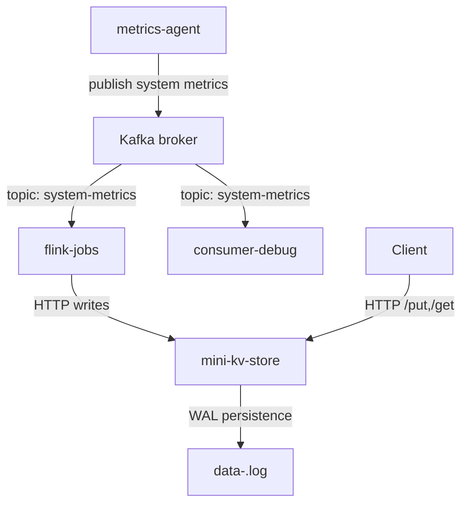

# mini-distributed-data-platform

A lightweight distributed data platform with a Go-based clustered key-value store, Kafka broker orchestration, a Python metrics producer, and a Python Kafka consumer for debugging.

This repository combines a simple `mini-kv-store` service with a Kafka-based metrics pipeline.

## Components

- `mini-kv-store/` — Go in-memory key/value store with optional cluster routing, JSON HTTP API, node-local WAL persistence, and analytics read endpoints (`GET /history`, `GET /latest`) implemented by `mini-kv-store/analytics-handlers.go`.
- `kafka/` — Docker Compose setup for a local Kafka KRaft broker that supports both container and host access.
- `metrics-agent/` — Python agent that collects host CPU/memory metrics and publishes them to Kafka topic `system-metrics`.
- `flink-jobs/` — Flink SQL pipeline that consumes metrics from Kafka, aggregates them, and writes results into `mini-kv-store` via HTTP.
- `consumer-debug/` — Python Kafka consumer that prints metrics from the `system-metrics` topic for debugging.

## Architecture

The project is split into two core subsystems:

1. Key-value store subsystem
   - `mini-kv-store` accepts `POST /put`, `GET /get`, `GET /history`, and `GET /latest`.
   - Writes are appended to `data-<node-id>.log` and reloaded on startup.
   - Optional cluster mode forwards writes to the owning node.

2. Metrics pipeline
   - `metrics-agent` collects system metrics and publishes them to Kafka.
   - `flink-jobs` consumes the `system-metrics` stream, aggregates metrics, and writes the aggregated results into `mini-kv-store` via HTTP.
   - `consumer-debug` subscribes to the `system-metrics` topic and prints incoming messages.

For a detailed architecture overview, see `ARCHITECTURE.md`.



## Getting Started

### Requirements

- Go 1.26 or later
- Docker and Docker Compose
- Python 3.11+ (or compatible)
- Python packages: `psutil`, `kafka-python`

### Start Kafka

```powershell
cd kafka
docker compose up -d
```

The Kafka broker is configured to listen on `localhost:9092`.

### Install Python dependencies

```powershell
python -m pip install -r metrics-agent/requirements.txt
```

### Run the metrics producer

```powershell
python metrics-agent/agent.py
```

This periodically publishes host metrics as JSON to Kafka topic `system-metrics`.

### Run the consumer debugger

```powershell
python consumer-debug/consume-metrics.py
```

This reads the same `system-metrics` topic and prints each metric record.

### Run the Flink job

```powershell
python flink-jobs/main.py
```

This starts the Flink SQL pipeline that reads metrics from Kafka and writes aggregated results to `mini-kv-store`.

### Run the key-value store

```powershell
cd mini-kv-store
go run .
```

Or build a binary:

```powershell
cd mini-kv-store
go build -o mini-kv-store .
.\mini-kv-store -port 8080 -node-id 1 -cluster "1=127.0.0.1:8080,2=127.0.0.1:8081,3=127.0.0.1:8082"
```

### Example API usage

#### Store a value

`POST /put`

Request body:

```json
{
  "key": "cpu",
  "value": "80"
}
```

Example:

```powershell
Invoke-WebRequest -Uri "http://localhost:8080/put" -Method Post -ContentType "application/json" -Body '{"key":"cpu","value":"80"}'
```

#### Retrieve a value

`GET /get?key=<key>`

```powershell
Invoke-WebRequest -Uri "http://localhost:8080/get?key=cpu" -Method Get
```

#### Retrieve the full history for a key

`GET /history?key=<key>`

Returns a JSON object with `key` and `history` array values via `mini-kv-store/analytics-handlers.go`.

```powershell
Invoke-WebRequest -Uri "http://localhost:8080/history?key=cpu" -Method Get
```

#### Retrieve the latest value for a key

`GET /latest?key=<key>`

Returns a JSON object with `key` and `latest` value, or a JSON error payload when the key is not found.

```powershell
Invoke-WebRequest -Uri "http://localhost:8080/latest?key=cpu" -Method Get
```

## Notes

- `mini-kv-store` stores values in memory and persists writes to a node-specific WAL file (`data-<node-id>.log`).
- In cluster mode, the service routes each key to its owning node and avoids duplicate writes on the origin node.
- Kafka is used for the metrics pipeline, and `flink-jobs` bridges Kafka with the key-value store by sending aggregated metrics to `mini-kv-store`.
- `flink-jobs/config.py` uses `host.docker.internal` so containerized Flink can reach the host `mini-kv-store` service on Windows/macOS.
- Use `localhost` from the host machine, but use `host.docker.internal` from inside Docker containers when accessing host services like `mini-kv-store`.
- The Python metrics agent publishes metrics as JSON strings, and the debug consumer prints decoded JSON values from Kafka.

## Recent changes (2026-06-02)

- Converted Flink metric aggregation to a tumbling window (non-overlapping windows).
- Flink now includes the `window_start` timestamp in aggregated results; the pipeline sends `window_start_ms` to the key-value store and uses `key = "{host}_{window_start_ms}"` to store per-window values.
- The Flink sink UDFs and `main.py` were updated to pass the window start timestamp into HTTP writes.
- `mini-kv-store` routing logic updated: target node is computed by hashing the `host` only (timestamps stripped) so per-window writes map to the correct owning node.
- Kafka listener config was updated to expose both container-internal (`broker:9092`) and host-local (`localhost:9092`) endpoints for convenience during development.
- `flink-jobs/config.py` now uses `host.docker.internal` for containerized Flink to reach the host `mini-kv-store` on Windows/macOS.

## File Layout

- `mini-kv-store/` — Go-based key-value store service
- `kafka/docker-compose.yaml` — Kafka broker configuration for local development
- `flink-jobs/` — Flink SQL pipeline for Kafka metrics aggregation and HTTP sink to the key-value store
- `metrics-agent/agent.py` — main metrics publisher loop
- `metrics-agent/metrics.py` — CPU/memory collection logic
- `metrics-agent/producer.py` — Kafka producer wrapper
- `consumer-debug/consume-metrics.py` — Kafka consumer for debugging metrics

## Performance Benchmark

The platform was benchmarked to evaluate the end-to-end performance of the distributed data pipeline and the key-value store APIs. The benchmark measured the time taken for requests to propagate through the system and for data to become available via the exposed endpoints.

### End-to-End Pipeline Benchmark

The benchmark script publishes metric messages to the Kafka topic `system-metrics` and continuously polls the `mini-kv-store` using the `/latest` endpoint until the updated value is observed. The elapsed time represents the end-to-end latency of the pipeline:

```
Metrics Agent → Kafka → Flink → mini-kv-store
```

Twenty benchmark iterations were executed, with five messages sent during each iteration. Successful executions produced end-to-end latencies that were typically between **0.76 s and 1.37 s**, with an average latency of approximately **0.95 s** (excluding a single 8 ms outlier). A number of iterations reached the configured timeout before an updated value was detected and were therefore reported as `ERROR` by the benchmark script.

### API Benchmark Results

The following execution times were obtained during benchmarking.

| Endpoint              | Benchmark Time (s) |
| --------------------- | -----------------: |
| Write (1000 requests) |            42.8646 |
| Read (1000 / 5000)    |              1.665 |
| History (1000 / 1000) |              2.264 |
| History (1000 / 5000) |              2.740 |

Additional benchmark runs produced the following results:

| Endpoint              | Benchmark Time (s) |
| --------------------- | -----------------: |
| Write (1000 requests) |           139.3589 |
| Read (1000 / 5000)    |             98.359 |
| History (1000 / 1000) |             35.556 |
| History (1000 / 5000) |            128.116 |

| Endpoint              | Benchmark Time (s) |
| --------------------- | -----------------: |
| Write (1000 requests) |           87.85801 |
| Read (1000 / 5000)    |            8.59962 |
| History (1000 / 1000) |           6.933098 |
| History (1000 / 5000) |           13.36172 |

These results demonstrate the functionality of the distributed data platform under different workloads and provide an estimate of the latency associated with write, read, and history retrieval operations, as well as the end-to-end streaming pipeline from Kafka through Flink to the key-value store.


## Changelog

See `CHANGELOG.md` for recent changes and project history.