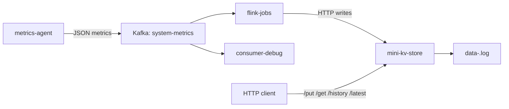

# Mini Distributed Data Platform

A compact distributed data platform that combines a Go key-value store with a Kafka-based metrics pipeline. It is intended as a learning project for service routing, write-ahead logging, stream processing, and lightweight observability workflows.

## What Is Included

- `mini-kv-store/`: Go HTTP key-value store with cluster routing, single-replica replication, node-local WAL persistence, and analytics endpoints.
- `kafka/`: Docker Compose setup for a local Kafka KRaft broker.
- `metrics-agent/`: Python producer that collects host CPU and memory metrics and publishes them to Kafka.
- `flink-jobs/`: PyFlink pipeline that aggregates Kafka metrics and writes results into the key-value store.
- `consumer-debug/`: Python Kafka consumer for inspecting raw metric events.
- `benchmarking-scripts/`: Small scripts for API and end-to-end latency experiments.

## Architecture



See [ARCHITECTURE.md](ARCHITECTURE.md) for the full architecture overview and [ARCHITECTURAL_DECISIONS.md](ARCHITECTURAL_DECISIONS.md) for design notes.

Benchmark strategy and latest local results are documented in [BENCHMARKING.md](BENCHMARKING.md).

## Requirements

- Go 1.26.3 or compatible
- Python 3.11+
- Docker and Docker Compose

Install Python dependencies as needed:

```powershell
python -m pip install -r metrics-agent/requirements.txt
python -m pip install -r flink-jobs/requirements.txt
```

## Quick Start

### 1. Start Kafka

```powershell
cd kafka
docker compose up -d
```

Kafka is exposed to host processes at `localhost:9092`.

### 2. Start the key-value store

From the repository root:

```powershell
go run ./mini-kv-store -port 8080 -node-id 1
```

For a three-node local cluster, start three terminals:

```powershell
go run ./mini-kv-store -port 8080 -node-id 1 -cluster "1=127.0.0.1:8080,2=127.0.0.1:8081,3=127.0.0.1:8082"
go run ./mini-kv-store -port 8081 -node-id 2 -cluster "1=127.0.0.1:8080,2=127.0.0.1:8081,3=127.0.0.1:8082"
go run ./mini-kv-store -port 8082 -node-id 3 -cluster "1=127.0.0.1:8080,2=127.0.0.1:8081,3=127.0.0.1:8082"
```

Optional local configuration can be copied from `.env.example`.

### 3. Publish metrics

```powershell
python metrics-agent/agent.py
```

### 4. Inspect raw Kafka messages

```powershell
python consumer-debug/consume-metrics.py
```

### 5. Run the Flink pipeline

```powershell
python flink-jobs/main.py
```

The Flink job consumes `system-metrics`, computes tumbling-window aggregates, and writes aggregate and alert records to `mini-kv-store`.

## API Examples

Store a value:

```powershell
Invoke-WebRequest -Uri "http://localhost:8080/put" -Method Post -ContentType "application/json" -Body '{"key":"cpu","value":"80"}'
```

Read a value:

```powershell
Invoke-WebRequest -Uri "http://localhost:8080/get?key=cpu" -Method Get
```

Read history for a host or logical key prefix:

```powershell
Invoke-WebRequest -Uri "http://localhost:8080/history?key=cpu" -Method Get
```

Read the latest value for a host or logical key prefix:

```powershell
Invoke-WebRequest -Uri "http://localhost:8080/latest?key=cpu" -Method Get
```

## Development Checks

```powershell
gofmt -w mini-kv-store
go test ./...
python -m compileall benchmarking-scripts consumer-debug flink-jobs metrics-agent
```

The GitHub Actions workflow in `.github/workflows/ci.yml` runs these checks for pull requests and pushes.
## Notes

- WAL files are named `data-<node-id>.log` and are intentionally ignored by Git.
- Generated binaries are ignored; build them locally with `go build`.
- Containerized Flink uses `host.docker.internal` to reach a host `mini-kv-store` process on Windows/macOS.
- From host processes, use `localhost` for Kafka and key-value store access.

## Project Status

This is a small educational platform, not a production datastore. It currently demonstrates basic request routing, WAL replay, simple replication, Kafka ingestion, windowed processing, and HTTP sink integration.

## Changelog

See [CHANGELOG.md](CHANGELOG.md).
