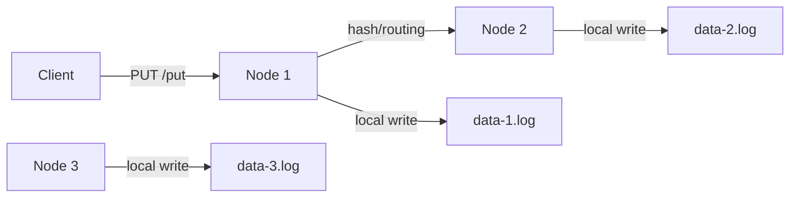

# mini-distributed-data-platform

A simple Go-based in-memory key-value store with optional clustering support, JSON POST ingestion, and a write-ahead log (WAL).

This project exposes a lightweight HTTP API for storing and retrieving string values by key. Incoming write requests are appended to a node-specific WAL file named `data-<node-id>.log` and are loaded back on startup. The project also supports a small multi-node cluster mode where keys are routed to owning nodes.

## Highlights

- Single-node and basic cluster mode (configured via flags or `.env`).
- `POST /put` accepts JSON payloads and will forward to the owning node when running in cluster mode.
- `GET /get?key=<key>` returns the stored value for a given key.
- In-memory store protected by a mutex for concurrency safety.
- Write-ahead logging to node-specific WAL files (`data-<node-id>.log`); malformed lines are skipped on load to avoid crashes.

## Architecture

The service is built around a single-node HTTP server with optional cluster-aware routing. Each node keeps an in-memory key/value store, persists writes to a local WAL file, and forwards requests to the owning node when needed.



## Build and Run

Run from the repository root:

```bash
cd c:/Users/vidya/OneDrive/Documents/Swati/mini-distributed-data-platform/mini-kv-store
go run .
```

Or build a binary:

```bash
go build -o mini-kv-store .
./mini-kv-store -port 8080 -node-id 1 -cluster "1=127.0.0.1:8080,2=127.0.0.1:8081,3=127.0.0.1:8082"
```

You can also set `NUMBER_OF_NODES` and other values in a `.env` file. The server prints the loaded `NUMBER_OF_NODES` at startup.

## API

### Store a value

`POST /put`

Request body (JSON):

```json
{
  "key": "cpu",
  "value": "80"
}
```

Example using PowerShell:

```powershell
Invoke-WebRequest -Uri "http://localhost:8080/put" -Method Post -ContentType "application/json" -Body '{"key":"cpu","value":"80"}'
```

When running in cluster mode the server computes the owner for the key. If another node owns the key, the request is forwarded to that node and the originating node will not re-write the value locally.

### Retrieve a value

`GET /get?key=<key>`

Example:

```powershell
Invoke-WebRequest -Uri "http://localhost:8080/get?key=cpu" -Method Get
```

## Notes

- The server stores values in memory; data is only reloaded from a node-specific WAL file (`data-<node-id>.log`) on startup.
- The WAL file is node-specific. On startup the loader skips malformed lines and continues.
- Cluster configuration: pass `-cluster` flag. `NUMBER_OF_NODES` can be set in `.env`. Node IDs in the config are 1-based (e.g., `1=127.0.0.1:8080`). Key hashing uses a zero-based index internally; the code maps that index to the node list correctly to avoid ID/index mismatches.

## File layout

- `Main.go` — server setup and route registration
- `handlers.go` — request handlers for `/put` and `/get`, forwarding logic
- `store.go` — shared in-memory store and mutex
- `wal.go` — write-ahead logging helper

## Recent fixes

- Fixed forwarded-request handling so only the owner writes to storage and WAL.
- Fixed WAL reading to avoid consuming request bodies before JSON decoding.

## Requirements

- Go 1.26 or later
