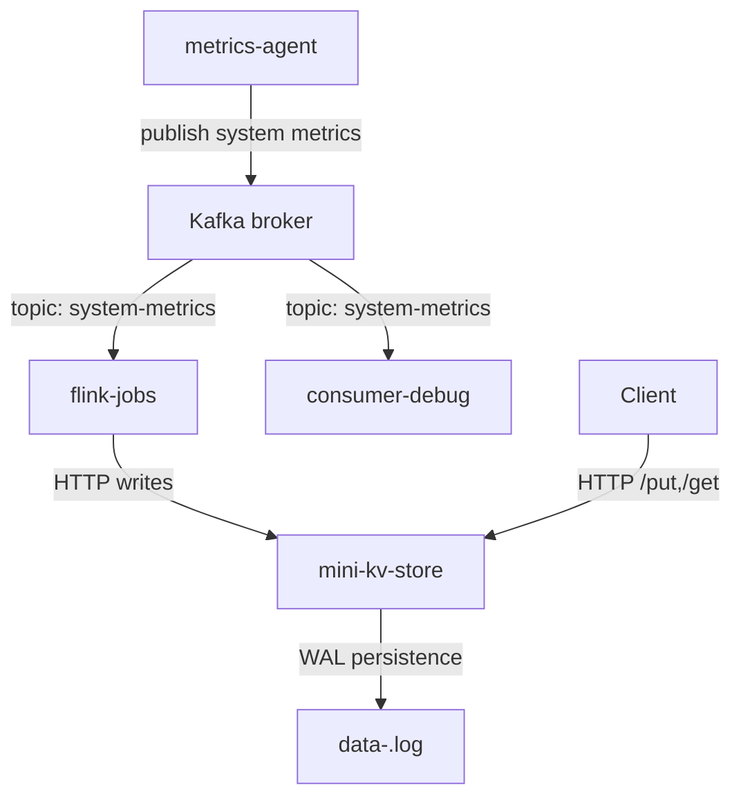

# mini-distributed-data-platform

A lightweight distributed data platform with a Go-based clustered key-value store, Kafka broker orchestration, a Python metrics producer, and a Python Kafka consumer for debugging.

This repository combines a simple `mini-kv-store` service with a Kafka-based metrics pipeline.

## Components

- `mini-kv-store/` — Go in-memory key/value store with optional cluster routing, JSON HTTP API, and node-local WAL persistence.
- `kafka/` — Docker Compose setup for a local Kafka KRaft broker that supports both container and host access.
- `metrics-agent/` — Python agent that collects host CPU/memory metrics and publishes them to Kafka topic `system-metrics`.
- `flink-jobs/` — Flink SQL pipeline that consumes metrics from Kafka, aggregates them, and writes results into `mini-kv-store` via HTTP.
- `consumer-debug/` — Python Kafka consumer that prints metrics from the `system-metrics` topic for debugging.

## Architecture

The project is split into two core subsystems:

1. Key-value store subsystem
   - `mini-kv-store` accepts `POST /put` and `GET /get`.
   - Writes are appended to `data-<node-id>.log` and reloaded on startup.
   - Optional cluster mode forwards writes to the owning node.

2. Metrics pipeline
   - `metrics-agent` collects system metrics and publishes them to Kafka.
   - `flink-jobs` consumes the `system-metrics` stream, aggregates metrics, and writes the aggregated results into `mini-kv-store` via HTTP.
   - `consumer-debug` subscribes to the `system-metrics` topic and prints incoming messages.

For a detailed architecture overview, see `ARCHITECTURE.md`.



## Getting Started

### Requirements

- Go 1.26 or later
- Docker and Docker Compose
- Python 3.11+ (or compatible)
- Python packages: `psutil`, `kafka-python`

### Start Kafka

```powershell
cd kafka
docker compose up -d
```

The Kafka broker is configured to listen on `localhost:9092`.

### Install Python dependencies

```powershell
python -m pip install -r metrics-agent/requirements.txt
```

### Run the metrics producer

```powershell
python metrics-agent/agent.py
```

This periodically publishes host metrics as JSON to Kafka topic `system-metrics`.

### Run the consumer debugger

```powershell
python consumer-debug/consume-metrics.py
```

This reads the same `system-metrics` topic and prints each metric record.

### Run the Flink job

```powershell
python flink-jobs/main.py
```

This starts the Flink SQL pipeline that reads metrics from Kafka and writes aggregated results to `mini-kv-store`.

### Run the key-value store

```powershell
cd mini-kv-store
go run .
```

Or build a binary:

```powershell
cd mini-kv-store
go build -o mini-kv-store .
.\mini-kv-store -port 8080 -node-id 1 -cluster "1=127.0.0.1:8080,2=127.0.0.1:8081,3=127.0.0.1:8082"
```

### Example API usage

#### Store a value

`POST /put`

Request body:

```json
{
  "key": "cpu",
  "value": "80"
}
```

Example:

```powershell
Invoke-WebRequest -Uri "http://localhost:8080/put" -Method Post -ContentType "application/json" -Body '{"key":"cpu","value":"80"}'
```

#### Retrieve a value

`GET /get?key=<key>`

```powershell
Invoke-WebRequest -Uri "http://localhost:8080/get?key=cpu" -Method Get
```

## Notes

- `mini-kv-store` stores values in memory and persists writes to a node-specific WAL file (`data-<node-id>.log`).
- In cluster mode, the service routes each key to its owning node and avoids duplicate writes on the origin node.
- Kafka is used for the metrics pipeline, and `flink-jobs` bridges Kafka with the key-value store by sending aggregated metrics to `mini-kv-store`.
- `flink-jobs/config.py` uses `host.docker.internal` so containerized Flink can reach the host `mini-kv-store` service on Windows/macOS.
- Use `localhost` from the host machine, but use `host.docker.internal` from inside Docker containers when accessing host services like `mini-kv-store`.
- The Python metrics agent publishes metrics as JSON strings, and the debug consumer prints decoded JSON values from Kafka.

## File Layout

- `mini-kv-store/` — Go-based key-value store service
- `kafka/docker-compose.yaml` — Kafka broker configuration for local development
- `flink-jobs/` — Flink SQL pipeline for Kafka metrics aggregation and HTTP sink to the key-value store
- `metrics-agent/agent.py` — main metrics publisher loop
- `metrics-agent/metrics.py` — CPU/memory collection logic
- `metrics-agent/producer.py` — Kafka producer wrapper
- `consumer-debug/consume-metrics.py` — Kafka consumer for debugging metrics

## Changelog

See `CHANGELOG.md` for recent changes and project history.
